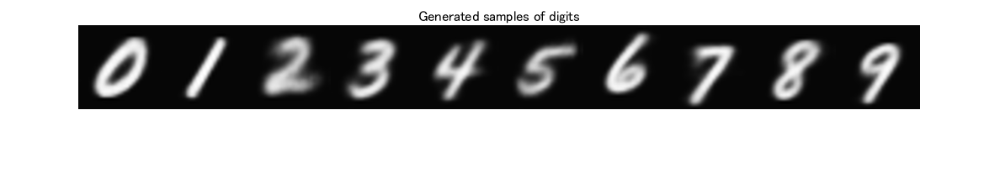
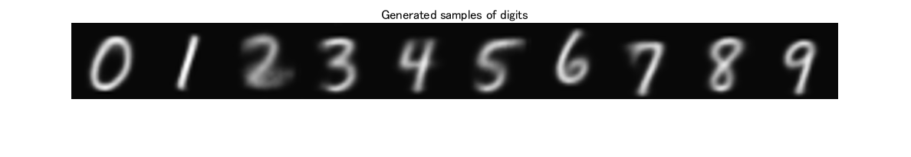
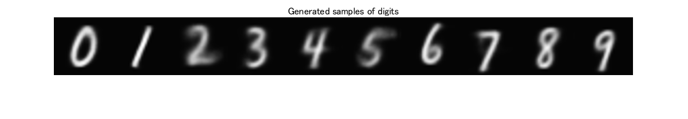
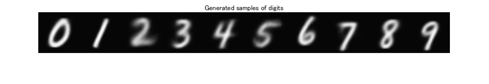
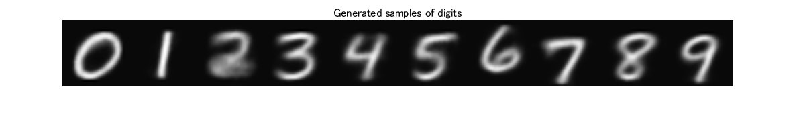

# Conditional variational autoencoder (CVAE)


This is a sample code of the conditional variational autoencoder for MATLAB.


このサンプルはconditional variational autoencoderをMATLABで実装したものです。


# Quick start - クイックスタート


The following code loads the trained decoder network and generates images of all classes with the common latent vector. Here, five trials are executed by changing the latent vector. See the feature of the generated images are similar. 


下のコードを実行すると、学習済みのデコーダが読み込まれ、0−9までの手書き数字文字が生成されます。潜在変数を変えて5回実行されます。それぞれの数字は共通の潜在変数から生成されていますので、それぞれ似た特徴を持っています。


```matlab
load decoderNet.mat;
latentDim = 20;
classNum = 10;
generate_for_quickstart(decoderNet, latentDim, classNum)
```















# Code for training - 学習用コード


The code for training network and image generation will be found:


学習および画像生成用のサンプルコードは下記ファイルをご覧ください。


(for English) GeneratingHanddrawnDigitsUsingConditionalVariationalAutoencoder_EN.mlx


(日本語)


GeneratingHanddrawnDigitsUsingConditionalVariationalAutoencoder_JP.mlx


# App - 試用アプリ


App *CVAENumGen.mlapp* is available for easy trial. This load the trained decoder. It generates hand-drawn digits images from 20-dimensional latent vectors as well as above. You can change each value in the vector by the sliders, though only some of them are efficient.


簡単に試せるようアプリ(CVAENumGen.mlapp)を用意しました。このアプリは学習済みのネットワークを読み込み、上と同様に20次元の潜在変数から、手書き数字を生成します。潜在変数をスライダで変えることで、生成される画像も変えることができます。しかし、20次元のうち大きく影響するものは限られています。


